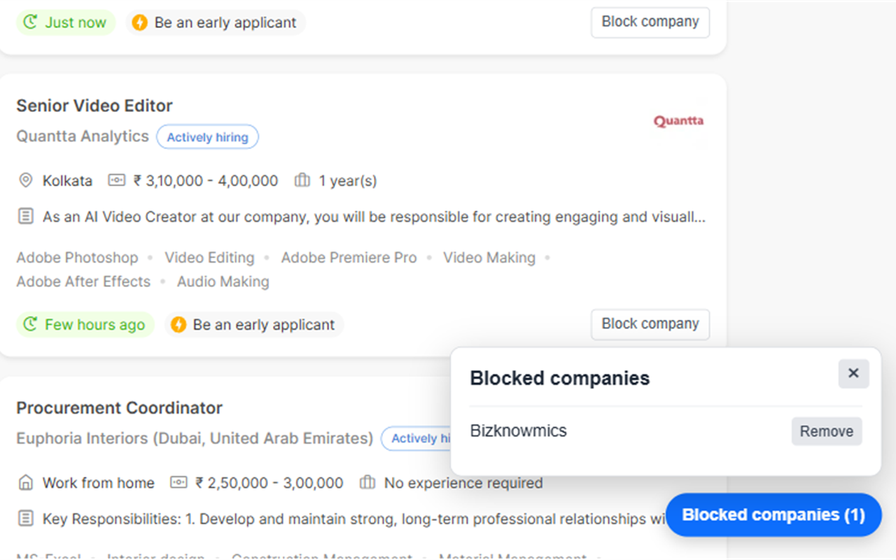

# Internshala Company Blocker

Hide internship and job listings from companies you do not want to see on Internshala.

## What it does

- Adds a **Block company** button to each supported listing card.
- Hides every listing from that company on the current results page.
- Keeps blocked companies hidden when you search, filter, scroll, or open another results page.
- Provides a floating blocklist where you can view and remove companies at any time.
- Stores the blocklist only in Chrome on your device.



## How to use it

1. Open an Internshala job or internship search page.
2. Click **Block company** on a listing you do not want to see again.
3. Open **Blocked companies** in the bottom-right corner to view or remove entries.

Removing a company makes its listings visible again immediately.

## Privacy

The extension processes company names from visible Internshala listing cards locally in your browser to hide matching cards. It stores only your blocked-company list in Chrome local storage and does not send listing data or personal information to any server.

Read the full [privacy policy](https://mdanas-exe.github.io/internshala-company-blocker/privacy-policy.html).

## Install locally in Chrome

The extension is installed locally from this repository. It is not required to be on the Chrome Web Store.

1. Clone the repository:

   ```bash
   git clone https://github.com/MDAnas-exe/internshala-company-blocker.git
   ```

2. Open Chrome and go to `chrome://extensions`.
3. Turn on **Developer mode** in the top-right corner.
4. Click **Load unpacked**.
5. Select the cloned `internshala-company-blocker` folder—the folder that contains `manifest.json`.
6. Confirm that **Internshala Company Blocker** appears in your extensions list.
7. Open an Internshala job or internship search page and refresh it once.
8. Confirm that **Block company** appears in the bottom-right corner of listing cards.

### After making changes

To download the latest version after it is updated on GitHub:

```bash
cd internshala-company-blocker
git pull origin main
```

Then return to `chrome://extensions`, click the refresh icon on the Internshala Company Blocker card, and refresh the Internshala page.

## Compatibility

Designed for Internshala job and internship listing pages. Internshala can change its page structure, so selector updates may occasionally be needed.

## Feedback

If a listing card does not show a **Block company** button, open an issue with the page URL and a screenshot of the card.
